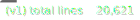
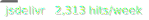

# Badges for Bored in School Right now

[](https://github.com/Bored-Entertainment/badges/actions/workflows/badges.yml)

## Lines of Code - New Version


```markdown

```

## Lines of Code - v1


```markdown

```

## Daily 


```markdown

```

## Weekly 


```markdown

```

## Monthly 


```markdown

```

## Yearly


```markdown

```
