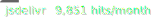
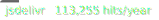

# CDN Badges for Bored in School Right now

## Daily [](https://github.com/Bored-Entertainment/badges/actions/workflows/bored.badge-day.yml)


```markdown

```

## Weekly [](https://github.com/Bored-Entertainment/badges/actions/workflows/bored.badge-week.yml)


```markdown

```

## Monthly [](https://github.com/Bored-Entertainment/badges/actions/workflows/bored.badge-month.yml)


```markdown

```

## Yearly [](https://github.com/Bored-Entertainment/badges/actions/workflows/bored.badge-year.yml)


```markdown

```
