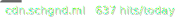
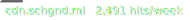
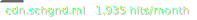
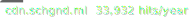

# CDN Badges for Schoolgrounds

## Lines of Code


```markdown

```

## Daily


```markdown

```

## Weekly


```markdown

```

## Monthly 


```markdown

```

## Yearly


```markdown

```

# Status of workflows
[](https://github.com/Bored-Entertainment/badges/actions/workflows/sch.lines-of-code.yml)

[](https://github.com/Bored-Entertainment/badges/actions/workflows/sch.badge-day.yml)

[](https://github.com/Bored-Entertainment/badges/actions/workflows/sch.badge-week.yml)

[](https://github.com/Bored-Entertainment/badges/actions/workflows/sch.badge-month.yml)

[](https://github.com/Bored-Entertainment/badges/actions/workflows/sch.badge-year.yml)
